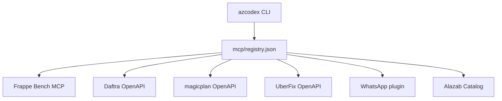

# Alazab Platform Layer

Az Codex extends the upstream-style Codex WebUI architecture with an Alazab-specific platform layer.

## Platform responsibilities

The Alazab layer is responsible for:

- Microsoft Foundry-backed `azcodex` profile management.
- Frappe/ERPNext development rules and guarded Bench tooling.
- Registry-driven integrations under `mcp/`.
- Arabic localization and RTL-ready message sources.
- Production deployment assets for `codex.alazab.com`.
- Operational verification before deployment.

## Integration topology



The registry is the canonical provider inventory. New provider-specific paths should not be hard-coded into multiple runtime files.

## Repository layout

```text
az-codex/
├── AGENTS.md              repository engineering contract
├── backend/               Rust gateway/runtime
├── bin/                   user-facing CLIs
├── deploy/                production deployment assets
├── docs/                  architecture and operations
├── frontend-tests/        frontend behavior tests
├── mcp/                   integration hub
│   ├── registry.json
│   ├── registry.schema.json
│   ├── alazab-catalog/
│   ├── daftra/
│   ├── magicplan/
│   ├── uberfix/
│   └── whatsapp/
├── messages/              translations
├── scripts/               tooling/tests/verification
├── src/                   SvelteKit UI
├── static/                static assets
└── templates/             managed external profiles/instructions
```

## Production validation

The baseline production gate is:

```bash
pnpm verify:secrets
pnpm mcp:doctor
pnpm test:unit
pnpm check
pnpm check:gateway
pnpm build
pnpm verify
pnpm pack:check
```

`pnpm release:check` runs the complete release gate.

## Runtime credentials

Integration specs may declare credential names and placeholders but must never contain production credential values. Runtime credentials are injected through the server environment or a dedicated secret manager.

Examples:

```text
{{client_secret}}
{{apikey}}
${DAFTRA_CLIENT_SECRET}
${META_TOKEN}
```

## Frappe policy

Frappe Bench integration is a controlled engineering interface, not a general shell escape. The agent should prefer the explicit Bench tools for status, schema inspection, tests, build and migrate operations. Production-destructive operations remain outside the normal autonomous path.

## Deployment model

`codex.alazab.com` terminates TLS at Nginx. The Az Codex gateway remains loopback-bound. systemd owns process lifecycle and runtime environment loading. Deployment assets live under `deploy/`; production values do not.
